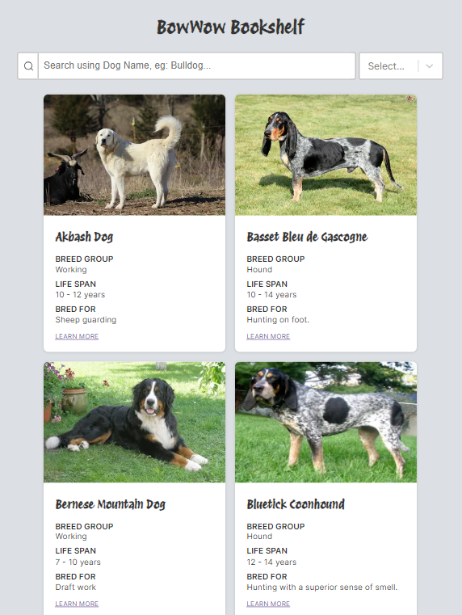

# BowWow Bookshelf

> BowWow Bookshelf is a mini library where you can find facts about different breeds of dogs.
> If you are a dog lover, it's especially for you _wink_.
> It takes some time for the data to load from the API. Just be patient when the data loads _hehe_

### Website

> To visit the website, click [here](https://bowwow-bookshelf-nine.vercel.app/)

https://github.com/ShivaniKhatri96/dog-library/assets/48630686/6fe56597-53b8-4ae5-9d89-4dd7c3b56bb7

### Tools used

> This is a frontend project using external API

- Next.js
- Typescript
- CSS
- React-select (library)
- [Dog API](https://thedogapi.com/)

### Responsive Design

> This project is done with responsive design in mind. It adapts to different screen sizes.
> Below you can see example for mobile, tablet and large screens.
>

### Functionalities

- Data is rendered from the [Dog API](https://thedogapi.com/) and shown in a **Grid layout** 
- **Loading animation** is added from [lottieFiles](https://lottiefiles.com/) when the data is loading
- **Session storage** is used to store data temporarily
- String is truncated with **text-transform:Ellipsis** in the Grid layout when the text is too long
- **Search bar (using URL params)** is added to filter dogs based on their species name
- **Select / dropdown is added using React-select** to filter species based on breed group
- **(Server-side) Pagination** is added
- When results are not found while searching and/or selecting, another cute animation from [lottieFiles](https://lottiefiles.com/) is shown
- **'Learn more' button** takes you to **Article page** and shows more info about the species

### Linked used

- [lottieFiles](https://lottiefiles.com/) for adding animations
- [freepik](https://www.freepik.com/free-vector/seamless-animal-pattern-background-cute-paw-print-vector-illustration_20266394.htm#query=cartoon%20dog%20paw%20print&position=39&from_view=keyword&track=ais&uuid=d40c7f50-d738-47f7-a885-8f49fa6672db) for adding background Image for Article page
- [svgrepo.com](https://www.svgrepo.com/) for adding Icons (svg format)
